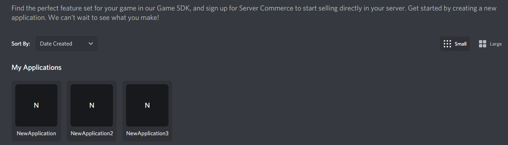
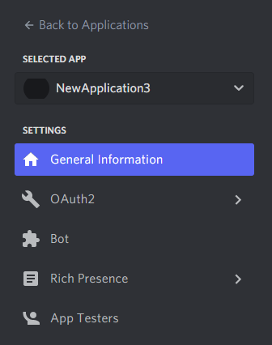
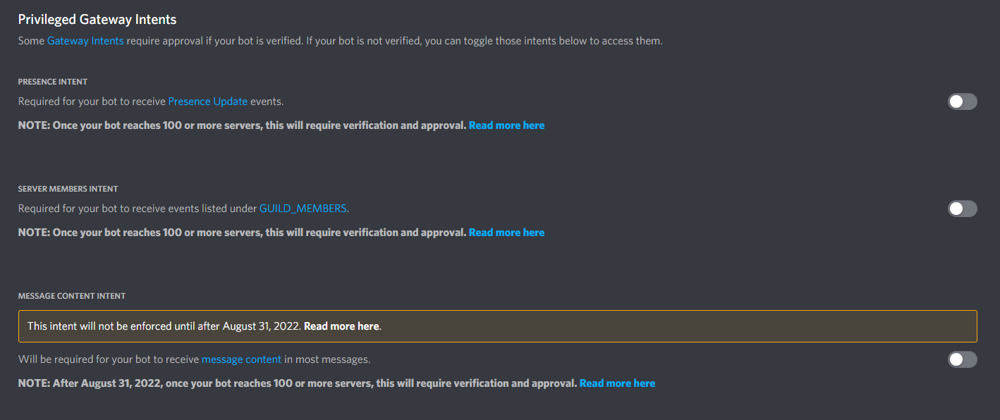
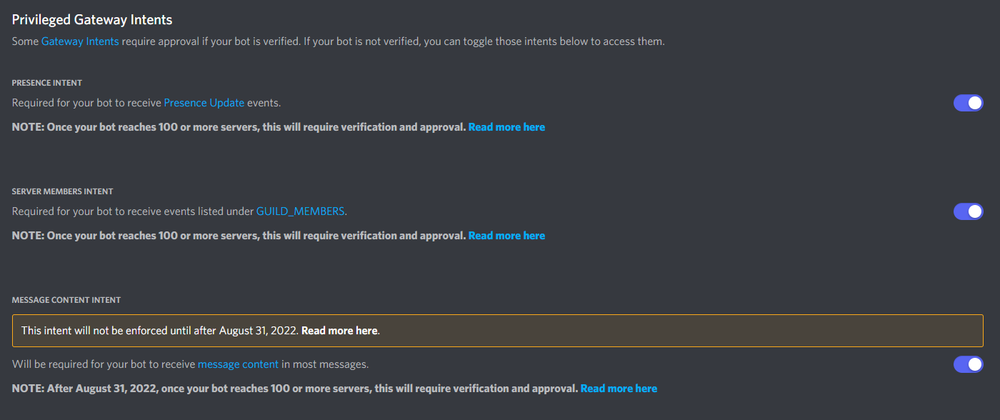

# intents.md
consoleに`インテントが無効になっています`と出て起動できない場合の対処法について書いています
 まず[こちら](https://discord.com/developers/applications/)のページへ移動してください
 そうしたら下記の画像のようになっているはずですのでこのプロジェクトで使用しているBotを選択してください

 そうしたら次に下記の画像のような項目があるので
 ここからBotという項目を選択してください

 そして少し下にスクロールすると下記画像のと同じ項目があるので

 この3つをすべてONにしてください

(上記の画像のようにすべて青色になっていれば問題ありません)
 すべてONにできたら保存してもう一度起動してみてください
